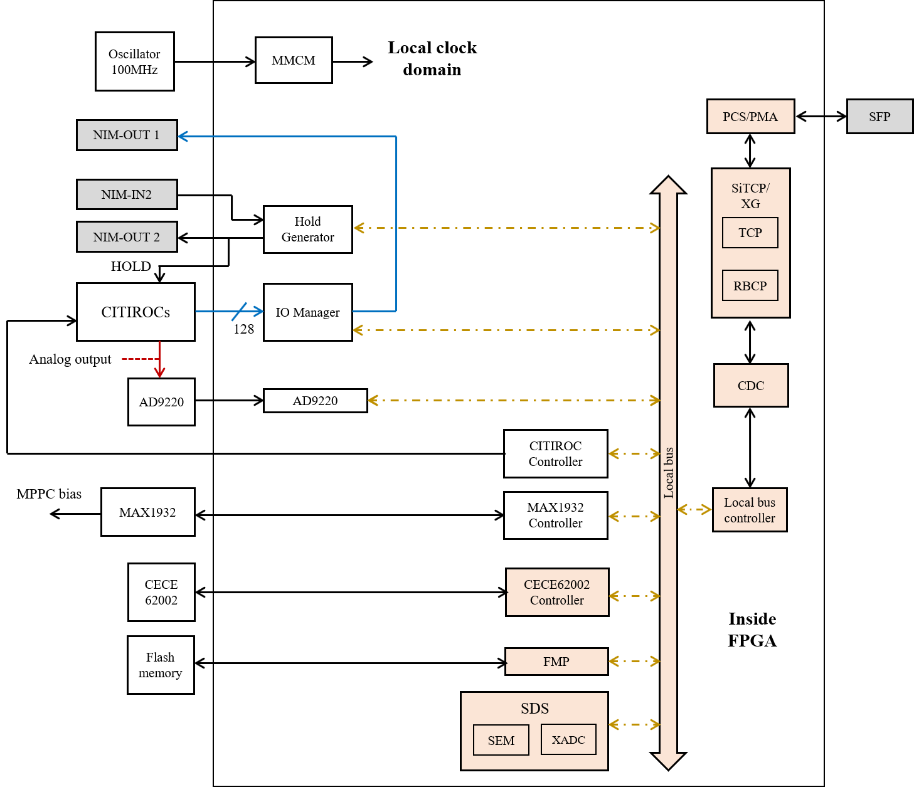

# Skeleton firmware

## Overview

CIRASAME skeleton is a template firmware including only some basic functions.
It does not contains the functionalities for clock synchronization and data acquisition.
This is basically the same as the AMANEQ skeleton, but it has some dedicated functions for the CIRASAME board.
See also the user guide for the [AMANEQ firmware overview](https://spadi-alliance.github.io/ug-amaneq/firmware/overview/overview/) and the [AMANEQ skeleton](https://spadi-alliance.github.io/ug-amaneq/firmware/skeleton/skeleton/).

[Github repository](https://github.com/spadi-alliance/CIRASAME-Skeleton)

```
- Unique ID:                  0x413E

- Link protocol:              SiTCP
- Default IP:                 192.168.10.16
- Data link speed:            1Gbps
```

### History

|Version|Date|Changes|
|:----:|:----|:----|
|v2.0|2024.6.4|De facto first version|

## Functions

{: #FW-VIEW width="80%"}

The CIRASAME skeleton firmware includes some dedicated local bus modules for operating MPPCs and CITIROCs in addition to the common modules.
The APD bias IC, MAX1932, is controlled through the MAX1932 Controller.
CITIROCs are controlled by the CITIROC Controller.
To access this module, the dedicated software is necessary. Please see the software section.
The comparator outputs from CITIROCs are connected to the IO manager selecting one of them to output from the NIM-OUT1 output.

For the charge measurement, the CITIROC requires a HOLD signal to keep the signal peak height during the ADC readout process.
The HOLD signal input from the NIM-IN2 is delayed with 2ns steps to adjust the hold timing.
The analog output for high-gain side is fed into AD9220 ADC, and the data digitized are collected by the AD9220 module in FPGA.
ADC data are sent to a PC via not TCP but RBCP in SiTCP.
Since the ADC readout function is independent from the LACCP and the Str-TDC, this is not a part of the DAQ functionalities.
**The developer does not expect that users take ADC data in the physics experiment.**
It is a kind of the debug function.

Please use this firmware for IC initialization, ASIC health checks, etc.

### LED and DIP switch

|DIP #||Comment|
|:----:|:----|:----|
|1| SiTCP IP setting | 0: Use default IP <br> 1: Use IP address set by users (License is required).|
|2| Not in use | |
|3| Not in use | |
|4| Not in use | |

## Local bus modules

The Str-LRTDC includes 9 local bus modules.
The local bus address map is as follows.

|Local Module|Address range|
|:----|:----|
|Hold Generator          |0x1000'0000 - 0x1FFF'0000|
|AD9220                  |0x2000'0000 - 0x2FFF'0000|
|CITIROC Controller      |0x3000'0000 - 0x3FFF'0000|
|IO Manager              |0x4000'0000 - 0x4FFF'0000|
|Scaler                  |0x8000'0000 - 0x8FFF'0000|
|MAX1932 Controller      |0x9000'0000 - 0x9FFF'0000|
|CDCE62002 Controller    |0xB000'0000 - 0xBFFF'0000|
|Self Diagnosis System   |0xC000'0000 - 0xCFFF'0000|
|Flash Memory Programmer |0xD000'0000 - 0xDFFF'0000|
|Bus Controller          |0xE000'0000 - 0xEFFF'0000|

## CITIROC Control

### CITIROC Controller

The CITIROC has a SPI port for register setting, and the CITIROC Controller provides the SPI data and the clock signal for this port.
Since the SPI ports are connected in series, all the CITIROCs are set to register at once.
Users who are familiar with CITIROC will notice that they can perform register read-back by monitoring the SRO signal, but such a function is not implemented in CIRASAME.

### Register address map

The dedicated software to use the CITIROC Controller is prepared, please use that.
The author feels that it is not realistic to access this module using only write/read_register.

|Register name|Address|Read/Write|Bit width|Comment|
|:----|:----|:----:|:----:|:----|
|kAddrSCFIFO    | 0x80000000|  W|1| Write SPI data to the buffer|
|kAddrPDC       | 0x80100000|  W|2| Update the pin direct control registers|
|kAddrCC        | 0x80200000|  W|-| Start a SPI cycle|

## ADC readout

Since the ADC readout function is developed as a debug tool, this function is not well matured.
The J-PARC E50 member can skip this sub-section.
It is designed to collect ADC data with low rate trigger input in a stand-alone mode.
Data taking with multiple boards are not considered since the hardware busy is not implemented.
**The author emphasize that it is a debug tool, please do not use for the physics experiment.**

### Hold Generator

First,