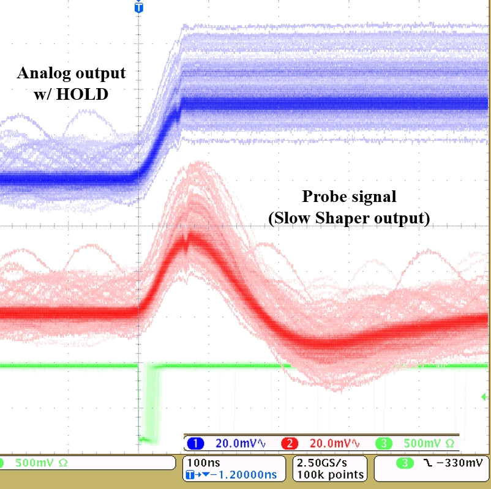
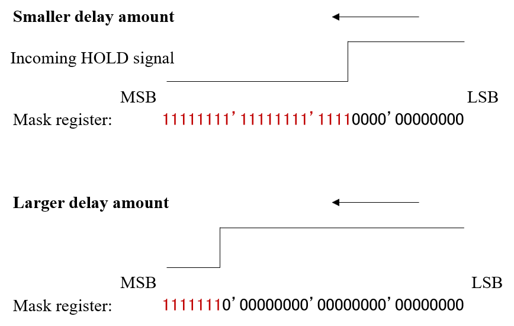

# Skeleton firmware

## Overview

CIRASAME skeleton is a template firmware including only some basic functions.
It does not contains the functionalities for clock synchronization and data acquisition.
This is basically the same as the AMANEQ skeleton, but it has some dedicated functions for the CIRASAME board.
See also the user guide for the [AMANEQ firmware overview](https://spadi-alliance.github.io/ug-amaneq/firmware/overview/overview/) and the [AMANEQ skeleton](https://spadi-alliance.github.io/ug-amaneq/firmware/skeleton/skeleton/).

[Github repository](https://github.com/spadi-alliance/CIRASAME-Skeleton)

```
- Unique ID:                  0x413E

- Link protocol:              SiTCP
- Default IP:                 192.168.10.16
- Data link speed:            1Gbps
```

### History

|Version|Date|Changes|
|:----:|:----|:----|
|v2.0|2024.6.4|De facto first version|

## Functions

{: #FW-VIEW width="80%"}

The CIRASAME skeleton firmware includes some dedicated local bus modules for operating MPPCs and CITIROCs in addition to the common modules.
The APD bias IC, MAX1932, is controlled through the MAX1932 Controller.
CITIROCs are controlled by the CITIROC Controller.
To access this module, the dedicated software is necessary. Please see the software section.
The comparator outputs from CITIROCs are connected to the IO manager selecting one of them to output from the NIM-OUT1 output.

For the charge measurement, the CITIROC requires a HOLD signal to keep the signal peak height during the ADC readout process.
The HOLD signal input from the NIM-IN2 is delayed with 2ns steps to adjust the hold timing.
The analog output for high-gain side is fed into AD9220 ADC, and the data digitized are collected by the AD9220 module in FPGA.
ADC data are sent to a PC via not TCP but RBCP in SiTCP.
Since the ADC readout function is independent from the LACCP and the Str-TDC, this is not a part of the DAQ functionalities.
**The developer does not expect that users take ADC data in the physics experiment.**
It is a kind of the debug function.

Please use this firmware for IC initialization, ASIC health checks, etc.

### LED and DIP switch

|DIP #||Comment|
|:----:|:----|:----|
|1| SiTCP IP setting | 0: Use default IP <br> 1: Use IP address set by users (License is required).|
|2| Not in use | |
|3| Not in use | |
|4| Not in use | |

## Local bus modules

The Str-LRTDC includes 9 local bus modules.
The local bus address map is as follows.

|Local Module|Address range|
|:----|:----|
|Hold Generator          |0x1000'0000 - 0x1FFF'0000|
|AD9220                  |0x2000'0000 - 0x2FFF'0000|
|CITIROC Controller      |0x3000'0000 - 0x3FFF'0000|
|IO Manager              |0x4000'0000 - 0x4FFF'0000|
|Scaler                  |0x8000'0000 - 0x8FFF'0000|
|MAX1932 Controller      |0x9000'0000 - 0x9FFF'0000|
|CDCE62002 Controller    |0xB000'0000 - 0xBFFF'0000|
|Self Diagnosis System   |0xC000'0000 - 0xCFFF'0000|
|Flash Memory Programmer |0xD000'0000 - 0xDFFF'0000|
|Bus Controller          |0xE000'0000 - 0xEFFF'0000|

## CITIROC Control

### CITIROC Controller

The CITIROC has a SPI port for register setting, and the CITIROC Controller provides the SPI data and the clock signal for this port.
Since the SPI ports are connected in series, all the CITIROCs are set to register at once.
Users who are familiar with CITIROC will notice that they can perform register read-back by monitoring the SRO signal, but such a function is not implemented in CIRASAME.

The dedicated software to use the CITIROC Controller is prepared, please use that.
The author feels that it is not realistic to access this module using only write/read_register.

|Register name|Address|Read/Write|Bit width|Comment|
|:----|:----|:----:|:----:|:----|
|kAddrSCFIFO    | 0x80000000|  W|1| Write SPI data to the buffer|
|kAddrPDC       | 0x80100000|  W|2| Update the pin direct control registers|
|kAddrCC        | 0x80200000|  W|-| Start a SPI cycle|

## ADC readout

Since the ADC readout function is developed as a debug tool, this function is not well matured.
The J-PARC E50 member can skip this sub-section.
It is designed to collect ADC data with low rate trigger input in a stand-alone mode.
Data taking with multiple boards are not considered since the hardware busy is not implemented.
**The author emphasize that it is a debug tool, please do not use it for physics experiments.**

### Hold Generator

The charge measurement method of CITIROC is peak height hold.
Voltage when receiving the HOLD signal is kept in a capacitance in CITIROC, and then stored DC voltage is multiplexed and digitized by AD9220 channel by channel.
To hold the pulse peak position, users need to send the HOLD signal at appropriate timing.
As shown in the [figure](#HOLD-ANALOG), the pulse height is held while the HOLD signal takes a logic high.
Note that only the analog output is affected by the HOLD signal, the slow shaper output from the probe port is not held even you input the HOLD signal because the probe line is branched before the HOLD function.

{: #HOLD-ANALOG width="80%"}

Then, users need to adjust the HOLD signal timing precisely so that the HOLD signal is input just at the pulse peaking timing.
The Hold Generator is used for this purpose, and it can provide 64ns delay amount in maximum with 2ns steps.
This unit has 32-bit length mask register, which determines the delay amount.
The incoming pulse runs from the left side as shown in the [figure](#HOLD-GEN).
When the pulse reaches the bit position where the bit is set to 1, the delayed HOLD signal takes a logic 1.
Please fill 1 continuously from the MSB side of the mask register, and the longer the length of 1 gives the smaller delay amount.

The delayed HOLD signal is then output from the NIM-OUT-2.

{: #HOLD-GEN width="80%"}

The register address map of the Hold Generator is as follows.

|Register name|Address|Read/Write|Bit width|Comment|
|:----|:----|:----:|:----:|:----|
|kAddrDelayMask  | 0x10000000|  R/W |32| Delay mask register|

### AD9220

The AD9220 module reads the data from the ADC (AD9220) on the board.
This modules requires the delayed HOLD signal from the Hold Generator.
Please set the mask register to the Hold Generator before accessing this module.
Although the data readout trigger to this module is the HOLD signal, it does not start the data read cycle only with the HOLD signal input.
To start the read cycle, users need to open the daq gate through RBCP.
Thus, the procedure for the ADC data read is as follows.

1. Set and adjust the mask register for the Hold Generator
2. Open the daq gate
3. Check the event buffer status
4. If an event exists, read an event from the buffer
5. Repeat No.3 and 4
6. Close the daq gate when stopping data taking

The simple software to read ADC data is prepared in cirasame-soft.

The register address map of the AD9220 module is as follows.

|Register name|Address|Read/Write|Bit width|Comment|
|:----|:----|:----:|:----:|:----|
|kAddrDaqGate      | 0x20000000|  R/W |1| DAQ gate bit|
|kAddrEventFull    | 0x20100000|  R   |1| Flag indicating event existence|
|kAddrReadFIFO     | 0x21000000|  R   |8| Data read from the event buffer|
|kAddrReleaseBusy  | 0x22000000|  W   |-| Manual busy release. Use this if the read sequencer is dead locked.|

## MPPC bias supply

### MAX1932 Controller

This module provides the SPI interface for a MAC1932 IC, which is a bias supply for MPPCs.
The MAX1932 IC can bias sensors between 40V - 70V with 256 (8-bit) steps.
The register value 1 provides the maximum voltage of 70V, output voltage decreases as a function of the register value.
Note that the maximum voltage is not exactly 70V, and it has board dependence, probably.
If users want to know the exact output voltage, please measure it by a multimeter.
If you set the register value 0, the IC is turned off, and output voltage goes 0V.

|Register name|Address|Read/Write|Bit width|Comment|
|:----|:----|:----:|:----:|:----|
|kAddrTxd          | 0x90000000|  W   |1| 8-bit register to MAX1923|
|kAddrExecWrite    | 0x91000000|  W   |-| Execute SPI sequence|

## Signal selection

### IO Manager

This modules selects one of the comparator outputs from CITIROCs, and the selected one is output from NIM-OUT-1.
The value set to kAddrSelDiscri represents the selected channel.

|Register name|Address|Read/Write|Bit width|Comment|
|:----|:----|:----:|:----:|:----|
|kAddrSelDiscri    | 0x40000000|  W   |7| 7-bit channel number (default: 0x0)|
