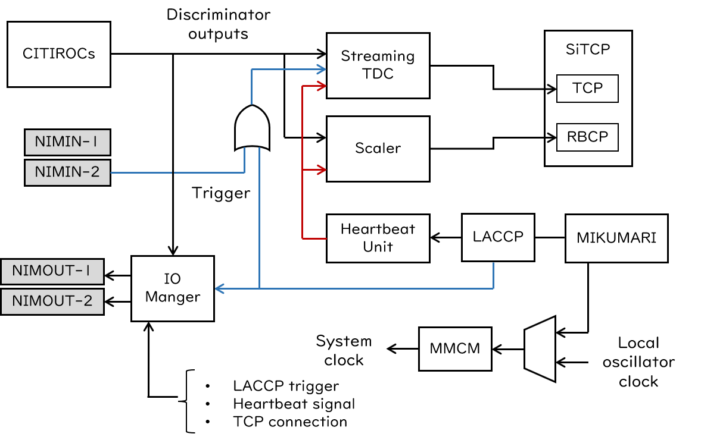
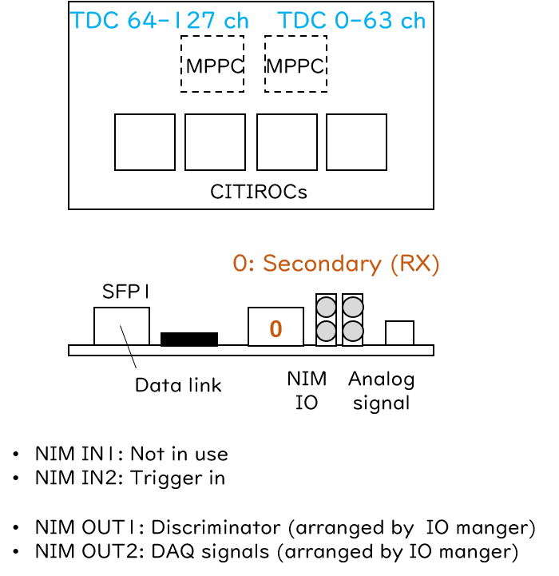

# Streaming low-resolution TDC

## Overview

The CIRASAME streaming low-resolution TDC (CIRASAME Str-LRTDC) is a continuous readout TDC with 1ns timing precision.
The main functionalities for data acquisition is the same as those of the [AMANEQ Str-LRTDC](https://spadi-alliance.github.io/ug-amaneq/firmware/strlrtdc/strlrtdc/).
Please understand the AMANEQ Str-LRTDC before reading this user guide.
See also the [overview section](https://spadi-alliance.github.io/ug-amaneq/firmware/overview/overview/) of the AMANEQ firmware.
In this user guide, the CIRASAME Str-LRTDC is simply called as Str-LRTDC.

[Github repository](https://github.com/spadi-alliance/CIRASAME-StrTdc)

```
- Unique ID:                  0x6041

- Number of inputs:           128
- Timing measurements:        Both edges
- TDC precision:              1ns
- Double hit resolution:      ~8ns
- Max TOT length:             4000ns

- Link protocol:              SiTCP
- Default IP:                 192.168.10.16
- Data link speed:            1Gbps

- Data word width:            64bit
- Acceptable max input rate:  ~14MHz/board
- System clock freq.:         125MHz
```

### History

|Version|Date|Changes|
|:----:|:----|:----|
|v2.7|2025.3.5|- Bugfix version of v2.6 <br> - Enabling the function to generate data words with input throttling type-2 start/end data types. |
|v2.6|2025.1.7| - Updating LACCP (v2.1) supporting the frame flag distribution. <br> - Introducing gated scaler.|
|v2.5|2024.6.4|事実上の初期版|


## Functions

{: #BL-DIAGRAM width="80%"}


The [figure](#BL-DIAGRAM) shows the simplified block diagram of CIRASAME Str-LRTDC firmware.
Unnecessary blocks not related to the DAQ functions are omitted for the figure.
The DAQ functionalities are basically the same that of AMANEQ Str-LRTDC.
The difference is the the number of input channels of 128 and existence of the IO manager.

{: #PORT-MAP width="80%"}

The [figure](#PORT-MAP) represents assignment of the TDC channel and the port number of the MIKUMARI link.
In this firmware, the channel number 0 is assigned to the MIKUMARI secondary (RX).
About the relation between the MPPC channel numbers and the TDC channel numbers, see also the MPPC sub-section in the hardware section.

### DIP switch

|DIP #||Comment|
|:----:|:----|:----|
|1| SiTCP IP setting | 0: Use default IP <br> 1: Use IP address set by users (License is required).|
|2| Not in use | |
|3| Standalone mode | 0: Use the MIKUMARI system<br>1: 1: Standalone mode|
|4| Not in use | |

## Local bus modules

The Str-LRTDC includes 11 local bus modules.
The local bus address map is as follows.

|Local Module|Address range|
|:----|:----|
|Mikumari Utility        |0x0000'0000 - 0x0FFF'0000|
|Hold Generator          |0x1000'0000 - 0x1FFF'0000|
|AD9220                  |0x2000'0000 - 0x2FFF'0000|
|CITIROC Controller      |0x3000'0000 - 0x3FFF'0000|
|IO Manager              |0x4000'0000 - 0x4FFF'0000|
|Streaming TDC           |0x5000'0000 - 0x5FFF'0000|
|Scaler                  |0x8000'0000 - 0x8FFF'0000|
|MAX1932 Controller      |0x9000'0000 - 0x9FFF'0000|
|CDCE62002 Controller    |0xB000'0000 - 0xBFFF'0000|
|Self Diagnosis System   |0xC000'0000 - 0xCFFF'0000|
|Flash Memory Programmer |0xD000'0000 - 0xDFFF'0000|
|Bus Controller          |0xE000'0000 - 0xEFFF'0000|

## Streaming-TDC block

The streaming low-resolution TDC implemented is the completely the same that of the AMANEQ Str-LRTDC.
See the [AMANEQ user guide](https://spadi-alliance.github.io/ug-amaneq/firmware/strlrtdc/strlrtdc/#streaming-tdc-block).
Only the local bus addresses are different from those of AMANEQ's firmware.


### Register address map

|Register name|Address|Read/Write|Bit width|Comment|
|:----|:----|:----:|:----:|:----|
|kTdcMaskMainU     | 0x5000'0000|   W/R|32|Channel mask for 0-31ch    (default: 0x0)|
|kTdcMaskMainD     | 0x5010'0000|   W/R|32|Channel mask for 32-63ch   (default: 0x0)|
|kTdcMaskMznU      | 0x5020'0000|   W/R|32|Channel mask for 64-95ch   (default: 0x0)|
|kTdcMaskMznD      | 0x5030'0000|   W/R|32|Channel mask for 96-127ch  (default: 0x0)|
|kTdcMaskEx        | 0x50E0'0000|   W/R|32|Channel mask for 128-159ch (default: 0x0)|
|	  		    | | | | |
|kEnBypass         | 0x5040'0000|   W/R|3|Enable bypass for 2-us delay buffer and paring unit. (default: 0x0) <br> 1st-bit: Enable bypass for 2-us delay buffer <br> 2nd-bit: Enable bypass for paring unit <br> 3rd-bit: Disable the LACCP fine offset correction. If disabling it, non-zero value appears in the LACCP fine offset region in 1st delimiter word.|
|	  		    | | | | |
|kTotFilterCtrl    | 0x5050'0000|   W/R|2|Enable TOT filter. (default: 0x0) <br> 1st-bit: Enable TOT filter unit <br> 2nd-bit: Enable zero-TOT through mode|
|kTotMinTh         | 0x5060'0000|   W/R|16|TOT filter low threshold|
|kTotMaxTh         | 0x5070'0000|   W/R|16|TOT filter high threshold|
|	  		    | | | | |
|kTrgEmuCtrl       | 0x5080'0000|   W/R|2|Set trigger emulation mode. (default: 0x0) <br> 1st-bit: Enable trigger gate mode <br> 2nd-bit: Enable Veto gate mode|
|kTrgEmuDelay      | 0x5090'0000|   W/R|8|Set the delay from the trigger (veto) input to opening the trigger (veto) gate. LSB precision is 8ns.|
|kTrgEmuWidth      | 0x50A0'0000|   W/R|16|Set the trigger (veto) gate width. LSB precision is 8ns.|
|			    | | | | |
|kHbfThrottCtrl    | 0x50B0'0000|   W/R|4|Set the heartbeat frame throttling condition. <br> 0x0: Disable (default) <br> 0x1: Only data for frame numbers that are multiples of 2 is acquired. <br> 0x2: Only data for frame numbers that are multiples of 4 is acquired. <br> 0x4: Only data for frame numbers that are multiples of 8 is acquired. <br> 0x8: Only data for frame numbers that are multiples of 16 is acquired.|
|			    | | | | |
|kHbdUserReg       | 0x50C0'0000|   W|16| The register value to be embedded to the 2nd delimiter word.|
| | | | | |
|kSelfRecoveryMode | 0x50D0'0000|   W/R|1| Enable the automatic recovery process for the local heartbeat frame mismatch (default: 0x0). |

## Scaler

The scaler implemented is the completely the same that of the AMANEQ Str-LRTDC.
See the [AMANEQ user guide](https://spadi-alliance.github.io/ug-amaneq/firmware/strlrtdc/strlrtdc/#scaler).

## ADC readout

**This function will be removed from this firmware in the future update.**

## IO Manager

The IO manager controls the path to NIM-OUT1 and 2.
The discriminator signals from CITIROCs are arranged to the NIM-OUT1.
This is the same that of Skeleton.
In addition, DAQ signals are arranged to the NIM-OUT2, and users can select one from the laccp trigger signal, the heartbeat signal, and the TCP connection status signal.

### Register address map

|Register name|Address|Read/Write|Bit width|Comment|
|:----|:----|:----:|:----:|:----|
|kAddrSelDiscri    | 0x40000000|  W   |7| 7-bit channel number (default: 0x0)|
|kAddrDaqSig       | 0x40100000|  W   |3| DAQ signal selection (default: 0x0)|
|kAddrOnOf         | 0x40200000|  W   |2| Enable/Disable of outputs. (default: 0x0)|

**Supplementary explanation**

- AddrDaqSig
    - 0x0: LACCP trigger signal
    - 0x1: Heartbeat signal
    - 0x2: TCP connection status signal
- AddrOnOff
    - 1st-bit: Enable/Disable NIM-OUT1 (1: enable).
    - 2nd-bit: Enable/Disable NIM-OUT2 (1: enable).