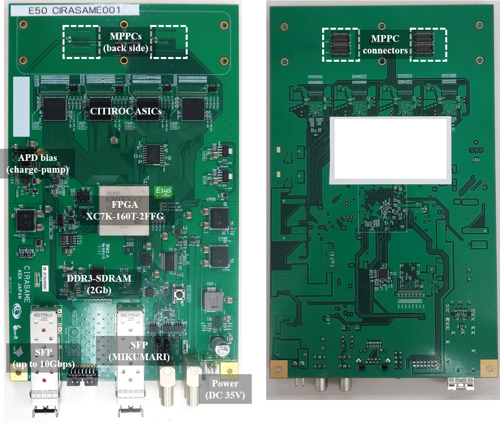
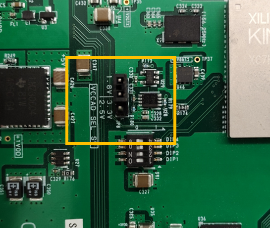
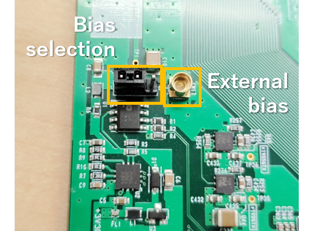
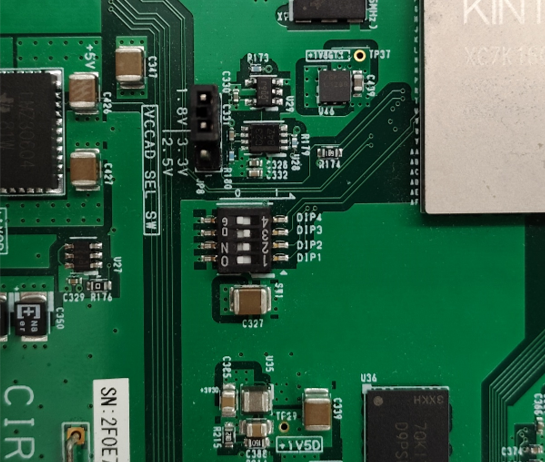
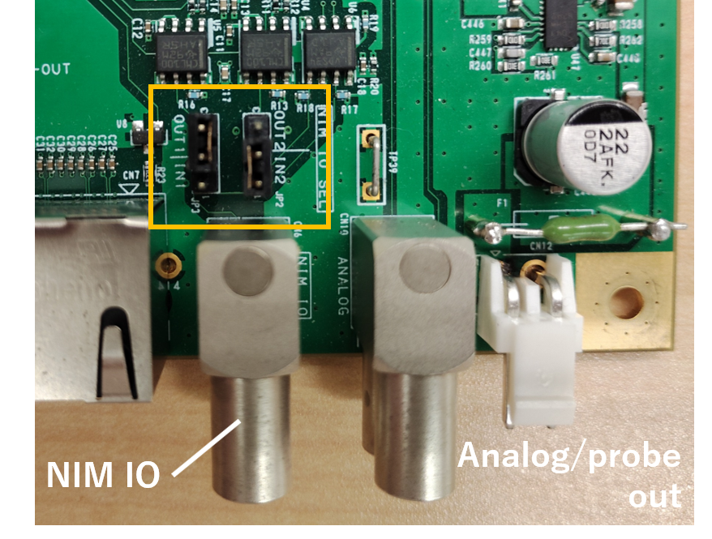
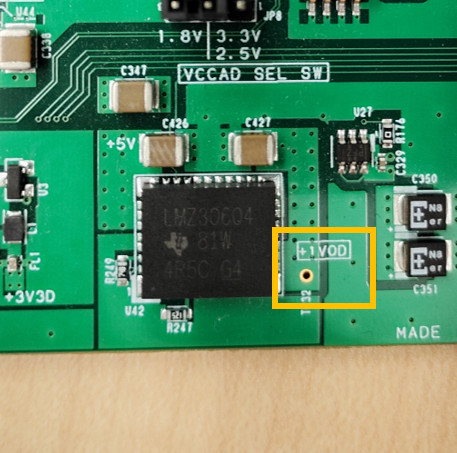

# CIRASAME board

CIRASAME (CITIROC based multi-MPPC readout electronics for continuous timing measurement) is a readout board for multi-MPPCs using [CITIROC 1A](https://www.caen.it/products/citiroc-1a/) ASICs.
This is dedicated electronics to readout scintillating fiber trackers for the J-PARC E50 experiment, and is designed as an on-detector type electronics to be attached to those detectors.
But, it can readout others detectors equipped with MPPCs.
This board design is sophisticated for implementing a streaming readout TDC since the J-PARC E50 experiment uses a trigger-less data-streaming type DAQ system.

- Manufacturer: 有限会社ジー・エヌ・ディー
- Product No: GN-2107-3

The [figure](#CIRASAME-PIC) shows the photograph of the CIRASAME board.
CIRASAME is a 128 mm x 200 mm sized readout board with connectors on the back of the board for mounting an MPPC.
The MPPC connector position is designed to mount HAMAMATSU S14826(ES1), which is special order product.
See the MPPC section for information on MPPC and ASIC channel mapping.
CIRASAME has a SFP+ port for a data link, a JTAG port, NIM IO, analog output ports, a MIKUMARI port for clock synchronization, and a power connector.
The FPGA mounted on the board is AMD Xilinx Kintex-7 FPGA (XC7K-160T-2FFG676C), which is the same as that of AMANEQ.
This board has the same a jitter (CDCE62002) and 2Gb DDR3-SDRAM as those on AMANEQ.
Thus, the digital part of CIRASAME is based on the design of AMANEQ, it uses many same ICs.
CIRASAME also has dedicated functionalities for operating MPPCs, i.e., an APD bias supply IC (MAX19232ETC+T).
Please also see the [AMANEQ user guide](https://spadi-alliance.github.io/ug-amaneq/).

{: #CIRASAME-PIC width="80%"}

The specification is summarized as follows.

- Size: 128 mm (H) x 200 mm (V)
- Num of MPPCs: 2 (S14826(ES1) x2)
    - 128ch in total
    - If you prepare an intermediate board changing a connector type, other types of MPPCs can be read.
- ASIC: Weeroc/Omega CITIROC 1A BGA x4
- Bias: MAX1932ETC+T
    - Supply range: 40-70V (256 steps)
- Analog outputs:
    - One analog high-gain output from CITIROC
    - One probe output from CITIROC
- FPGA: AMD Xilinx XC7K-160T-2FFG676C
- Flash memory: CYPRESS S25FL128SAGMFIR01
- Data links: SFP+ (10 Gbps in maximum)
    - Link media depends on the type of SFP modules.
- Clock synchronization: One MIKUMARI port (SFP)
- Num of NIM input: 1 (LEMO)
- Num of NIM output: 1 (LEMO)
- Power supply: 20-35V DC
    - Jack: 2.10mm ID, 5.50mm OD
    - Main connector: 日本圧着端子 S2P-VH(LF)(SN)
    - **Note that the connector is different from that on AMANEQ**
- Fuse limit: 1A
    - Fuse product: Littelfuse 0251001.NRT1L
- Num of DIP switch bits: 4
- Clock generator IC: TI CDCE62002
- External memory: 2Gb DDR3-SDRAM
    - Speed: DDR3-1333 (max)

{: #CIRASAME-BLOCK width="70%"}

MPPCs are biased by the MAX1932 bias supply, which is controlled by FPGA.
It can control output voltage with 256 steps between 40V to 70V.
The MPPC signal lines are parallel terminated with 100 ohm registers together with 0.22 uF capacitances for DC blocking.
The MPPC signals are fed into four CITIROCs, and are amplified, shaped, and discriminated in CITIROC.
For details of this ASIC, please see its data sheet.
The comparator (discriminator) outputs are input in parallel to the FPGA.
The signals are input to the streaming TDC and the scaler in the FPGA.

Since this board aims to have the function for the streaming TDC, the design of a charge measurement line is rather simplified.
Only the analog output for the high-gain side is arranged to ADC (AD9220) and to the analog output port with the LEMO type connector.
Since the analog output of the CITIROC without setting a read register bit becomes high impedance, four outputs are simply merged to one line.
The probe output from CITIROC are once connected to an analog switch controlled by the FPGA, and its output is arranged to the LEMO type connector.
The developer expects that these analog lines are used only for checking the signals using an oscilloscope.
The charge measurements with the DAQ function is not considered.

In the [figure](#CITIROC-BLOCK), the ASIC control lines from the FPGA are omitted.

## Board interface

### MPPC connector

{: #MPPC-CN width="80%"}

The [figure](#MPPC-CN) is the dimension drawing around the MPPC connectors when you view it from the solder side.
As mentioned above, this board is design to mount S14826(ES1), which is the special order product, not on the catalog.
Please contact with HPK if you order the same one.
If you need to readout other MPPC products using CIRASAME, please develop a board changing connector type based on this drawing.

### VCCAD selection switch

{: #VCCAD width="70%"}

Please short-circuit the 1.8V side pins as shown in the [figure](#VCCAD).

### MPPC bias

{: #BIAS width="70%"}

When you use MAX1932 as the MPPC bias supply, pleas short-circuit the left side jumper pins.
If you want to supply bias externally, please short-circuit the right side pins, and connect the bias cable to the MMCM connector.

### SFP-1

The SFP-1 port is for a data link of which the speed is 10 Gbps in maximum.
The SFP and SFP+ modules are applicable but the link speed depends on firmware.
As this port is the same as that on AMANEQ, please also see the [AMANEQ user guide](https://spadi-alliance.github.io/ug-amaneq/hardware/overview/overview/#sfp1-2).

### DIP, LED

{: #DIP width="70%"}

The DIP switch is set to the left side where "ON" is printed, a logic 0 is taken in the FPGA.
The function of each bit depends on each firmware.

There is no LED on CIRASAME even for indicating FPGA configuration done since CIRASAME is expected to be installed in a black box together with a detector.
Item emitting light is omitted.

### NIM

{: #NIM width="60%"}

Two LEMO connectors are assigned for NIM I/O, but two logic input lines and two logic output lines are assigned on the FPGA.
The signal path arrangement is determined by the jumper pins shown in the orange box in the [figure](#NIM).
In this figure, the output-1 and the input-2 are arranged to the LEMO connectors.
The upper and lower connectors are for signal-1 and signal-2, respectively.
The NIM IO uses the same logic translation ICs as those on AMANEQ.
See also the AMANEQ [user guide](https://spadi-alliance.github.io/ug-amaneq/hardware/overview/overview/#dip-led-nim).

### Power supply

The power supply connector is 日本圧着端子 S2P-VH(LF)(SN).
There is a rule for power on/off process. Please see the [AMANEQ user guide](https://spadi-alliance.github.io/ug-amaneq/hardware/overview/overview/#power-supply).

### MIKUMARI port

This is the same that of the AMANEQ. Please see the [AMANEQ user guide](https://spadi-alliance.github.io/ug-amaneq/hardware/overview/overview/#mikumari-port).

## Board ICs

The FPGA, the jitter cleaner IC, the DDR3-SDRAM, and the flash memory are the same those on AMANEQ.
Please see the [AMANEQ user guide](https://spadi-alliance.github.io/ug-amaneq/hardware/overview/overview/#power-supply-ics).

## Power supply ICs

{: #1V0D"}

The external DC voltage supply of 35V
CIRASAME uses the LT8612UDE to step down the external input of 35V to 5V, and then further steps it down to multiple power supply voltages.
A test pint are located near by each power supply IC as shown in the [figure](#1V0D).
Please confirm that every output voltage is correct after board delivery.

<table class="vmgr-table">
  <thead><tr>
    <th class="nowrap">Silk print</th>
    <th class="nowrap">Voltage</th>
    <th class="nowrap">Parts number</th>
    <th class="nowrap">Test pint number</th>
  </tr></thead>
  <tbody>
  <tr>
    <td class="tcenter">+5V</td>
    <td class="tcenter">+5.0V</td>
    <td class="tcenter">U47</td>
    <td class="tcenter">Nothing</td>
  </tr>
  <tr>
    <td class="tcenter">+3V3D</td>
    <td class="tcenter">+3.3V</td>
    <td class="tcenter">U43</td>
    <td class="tcenter">TP34</td>
  </tr>
  <tr>
    <td class="tcenter">+1V8D</td>
    <td class="tcenter">+1.8V</td>
    <td class="tcenter">U41</td>
    <td class="tcenter">TP33</td>
  </tr>
  <tr>
    <td class="tcenter">+1V0D</td>
    <td class="tcenter">+1.0V</td>
    <td class="tcenter">U42</td>
    <td class="tcenter">TP32</td>
  </tr>
  <tr>
    <td class="tcenter">+1V8GTX</td>
    <td class="tcenter">+1.8V</td>
    <td class="tcenter">U46</td>
    <td class="tcenter">TP37</td>
  </tr>
  <tr>
    <td class="tcenter">+1V2GTX</td>
    <td class="tcenter">+1.2V</td>
    <td class="tcenter">U44</td>
    <td class="tcenter">TP35</td>
  </tr>
  <tr>
    <td class="tcenter">+1V05GTX</td>
    <td class="tcenter">+1.05V</td>
    <td class="tcenter">U45</td>
    <td class="tcenter">TP36</td>
  </tr>
  <tr>
    <td class="tcenter">-3V3D</td>
    <td class="tcenter">-3.0V</td>
    <td class="tcenter">U7</td>
    <td class="tcenter">Nothing</td>
  </tr>
    <tr>
    <td class="tcenter">+3V3A</td>
    <td class="tcenter">+3.3V</td>
    <td class="tcenter">U39</td>
    <td class="tcenter">TP30</td>
  </tr>
    </tr>
    <tr>
    <td class="tcenter">VCCAD</td>
    <td class="tcenter">+1.8V</td>
    <td class="tcenter">U40</td>
    <td class="tcenter">TP31</td>
  </tr>
</tbody>
</table>

